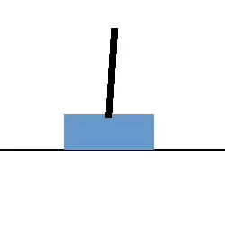

# Rusty CartPole

A physics demo of the cartpole problem written in Rust.



## Running

If you do not have Rust, install it from https://rustup.rs/ .

Second, clone the project and run the following command inside it:

```
cargo run
```
## Features

 - Physics decoupled from rendering by running in a seperate thread, with a constant ticker via the [`ticker` crate](https://crates.io/crates/ticker)
 - Multiple action senders possible via `std::sync::mpsc`
 - Multiple state readers possible via `bus::BusReader` from the [`bus` crate](https://crates.io/crates/bus)

## TODOs

- Use CasADi Sundials integrator
- Add Model Predictive Control using OptimizationEngine
- Implement Reinforcement Learning like outlined [in this blog](https://monadmonkey.com/bevy-dfdx-and-the-classic-cart-pole)

## License

Copyright © 2023 Walid-Rovo \
Rusty CartPole is made available under the terms of [the MIT License](LICENSE).
